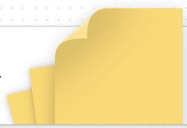
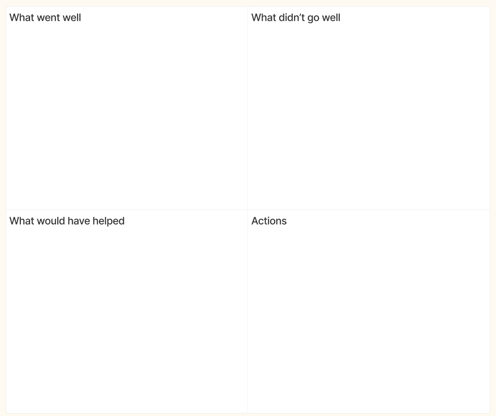

# TBD Retrospectives

Open source is about collaborative innovation - working together. Our projects evolve through incremental progress, as do the processes that support their growth. Regular feedback helps us accelerate what's working well, address friction early, and nurture the relationships powering our work. 

Done well, retros are uplifting. 🎉 They're a great opportunity for the team to recognize what they've done together, celebrate those accomplishments, call out the areas that made things more difficult than necesary, commit to changes, and move forward.

## Why Retro?

* 🏎️ **Fail fast** - Adapt processes rather than continue with something that's not working well
* 🧠 **Learn** - Surface highs and lows from your experience that help your teammates understand how to help you better
* 🔄 **Continuous improvement** - Foster a culture of being ever better rather than entrenching systems which may only work well at a moment in time

## When Retro?

This is ultimately up to the teams to determine! They may be organized around small groups to keep folks tightly aligned, and they may be larger and cross-functional to inspect how teams interact.

A good rule of thumb is at a natural boundary like the end of a feature delivery, milestone, or other deliverable. It can be time-boxed or feature-boxed -- but works best when retros are a regular occurance without too much time inbetween for issues to fester.

## What works?

In the early releases of Web5 and its supporting documentation, the cross-functional teams built a retrospective coordinated and led by [Kirah](https://github.com/kirahsapong). It's a simple model. We've assembled a [Figma template you may use as a starting point](https://www.figma.com/file/AmvfTl4mTdxLuX7MOrvcD8/TBD-Retrospective-Template?type=whiteboard&node-id=0-1&t=v7z8GZy8BjbrtaFq-0) for your own retros. For instance, you may:

1. Break the ice with a short check-in; an easy way of expressing how you're feeling, like:

* What meme describes how you're feeling?
* What would be your walk-in song?

2. Pick a unique color for your sticky note; we use this to share our observations.

3. Drop sticky notes onto the board, filling out sections for:

* What went well
* What didn't go well
* What could have helped

4. Sharing their experience. This is a great opportunity for the retro coordinator to group like items together. When done sharing, each team member may "popcorn" by nominating the next person to go.

5. Team reviews together the synthesized lessons they can extract, and inventory some actions to address them moving forward.

### Dos

* Feel free to share your experience. Very infrequently is there a clear right and wrong; more often there are varied perspectives. And no one can disagree with the impact systems have had on you and your work.
* Approach one another with _curiousity over judgment_. The more we understand where we're coming from, the more likely we'll see that we all have the same overarching goals - to make our work as efficient and successful as possible.

## Resources
* [TBD Figma Template](https://www.figma.com/file/AmvfTl4mTdxLuX7MOrvcD8/TBD-Retrospective-Template?type=whiteboard&node-id=0-1&t=v7z8GZy8BjbrtaFq-0)
* [Spotify Retro Kit](https://engineering.atspotify.com/2017/12/spotify-retro-kit/)
* [Scrum Retrospectives](https://www.scrum.org/resources/what-is-a-sprint-retrospective)